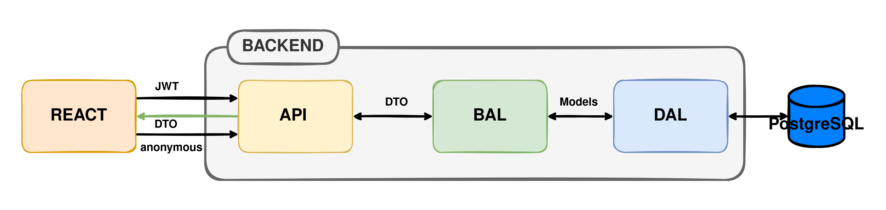
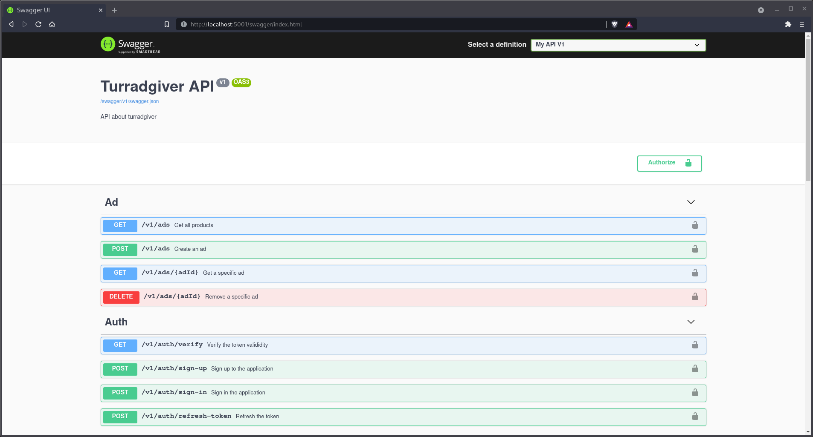

<p align="center">

</p>

# Turradgiver [backend]

## What is the goal of that project ?

This project has been implemented during a course of web services in ISIMA Engineer school.  

The goal of this project is to build a website similar to Tripadvisor using ASP.net for the backend and React for the frontend.  
This repository contain all the backend implementation using dotnet5.0.  
For the frontend built using react see the following repository: [zz2_ws_frontend](https://github.com/easy-ma/zz2_ws_frontend)  

The authors of this project are :

- [Babidiii](https://github.com/Babidiii)
- [BasileNq](https://github.com/BasileNq)
- [Khaaz](https://github.com/Khaaz)
- [xerstom](https://github.com/xerstom)

## Project structure

```
.
├── turradgiver-api/    << entry point (controllers...)
├── turradgiver-bal/    << business access layout (services...)
├── turradgiver-dal/    << data access layout (entities, db...)
├── turradgiver-test/   << tests 
├── notes/
├── README.md
├── docker-compose.yml  
└── turradgiver-backend.sln 
```

<p align="center">

</p>

The project is using: 

- EntityFramework with code first approach.  
- Automapper for mapping DTOs into Models and Models into DTOs
- API Versionning
- Swagger
- ...

## Development 

In order to run the project you can open the solution using vstudio or just using the docker-compose file with either docker-compose or podman-compose.

```sh
docker-compose -f docker-compose.yml up .
```

The docker-compose file is made for development with watch mode for autoreload.  
Feel free to change the dockerfile and add production target.

You will also need to update the connection string from the example in [appsetting.json](https://github.com/easy-ma/zz2_ws_backend/blob/main/turradgiver-api/appsettings.json) to the database you are using. After that you will have to use dotnet-ef inside the container in order to init or make new migrations.

## Swagger

The swagger instance is accessible on `http://localhost:5001/swagger/index.html`



# Extra

Some dummy notes about the project are available here in `notes` folder.


